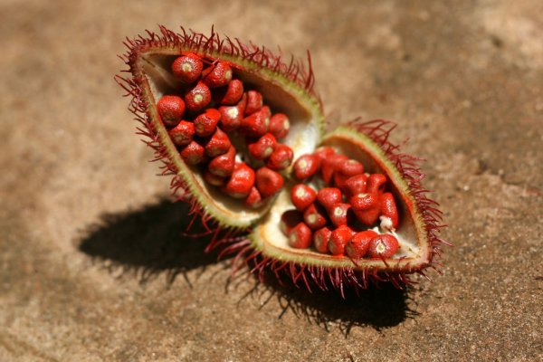

 <b>Conocimientos y actitudes ante el uso de achiote (Bixa orellana L.) como alternativa medicinal</b>

Es de suma importancia entender su conocimiento y actitud ante el uso de achiote (Bixa orellana L.) para poder lograr establecer el valor que actualmente se le brinda a esta planta, antiguamente utilizada por la cosmovisión Maya. Por medio de una encuesta se busca incrementar el conocimiento sobre los posibles usos de la planta de interés en distintos aspectos de la vida.

Actualmente, el uso de diferentes compuestos naturales ha aumentado debido a diferentes razones. Entre estas los altos costos de las medicinas y compuestos farmacéuticos, la dificultad de acceso a servicios de salud, entre otros. A su vez la medicina alternativa posee varios beneficios como los de tratamiento individualizado, la reducción de efectos secundarios, bajo costo, etc. Este estudio es importante, ya que permitirá evidenciar los niveles de conocimiento y actitudes existentes  respecto al uso de achiote como una alternativa de la medicina occidental. 

Consideramos que determinar el valor del achiote en la cultura actual despierta el interés tanto de nosotros como investigadores así como el suyo. Es por esto que aquí se presentan los resultados obtenidos de una encuesta contestada por 100+ guatemaltecos.

## investigacion_achiote
Análisis de datos en R con jupyter notebook sobre la encuesta "Conocimientos y actitudes ante el uso de achiote (Bixa orellana L.) como alternativa medicinal"

## Integrantes de investigación
- Isabel Cordón
- Pablo Viana
- Belém Gonzáles

## Listado de preguntas 
* "Id"
* "Ip"
* "Acceso"
* "Fecha y hora inicio"
* "Fecha y hora finalizacion"
* "Procedencia"
* "Municipio"
* "Rango edad"
* "Sexo"
* Q1: "¿Ha utilizado usted alguna planta para tratar alguna enfermedad/afeccion?"
* Q2: "¿Conoce usted el achiote?"
* Q3: "¿Estaría dispuesto a conocer más sobre los usos ancestrales del achiote?"
* Q4: "¿Qué tan efectivo cree usted que son los tratamientos alternativos de achiote?"
* "Justificacion"
* "He leido"
* Q5: "¿Conoce usted otro nombre para el achiote?"
* Q6: "¿Qué usos ha oido usted del achiote? ¿cuales usos le ha dado usted al achiote?"
* Q7: "Conoce como aplicaciones del achiote"
* Q8: "¿Con qué frecuencia utiliza el achiote en cualquiera de sus presentaciones?"
* Q9: "¿Cómo obtiene usted el achiote?"
* Q10: "¿Está usted al tanto que es posible conseguir achiote en los centro de conveniencia bajo el apartado de especias?"
* Q11: "parte de la planta Bixa orellana L. se utiliza para obtener el polvo rojo comunmente comercializado"
* Q12: "¿Conoce alguna otra planta tintorea de comida?"
* Q13: "¿Ha utilizado usted alguna planta tintorea de comida?"
* Q14: "¿Que formas de preparacion conoce usted para usar el achiote como medicina?"
* Q15: "¿Que tan dispuesto esta usted a utilizar el achiote como sustituto de la medicina occidental?"
* "Justificacion"
* Q16: "maneras en las cuales estaria usted de acuerdo en administrar medicamento fabricado con achiote"
* Q17: "¿Que tan efectivo cree usted que son los tratamientos alternativos de achiote?"
* "Justificacion"